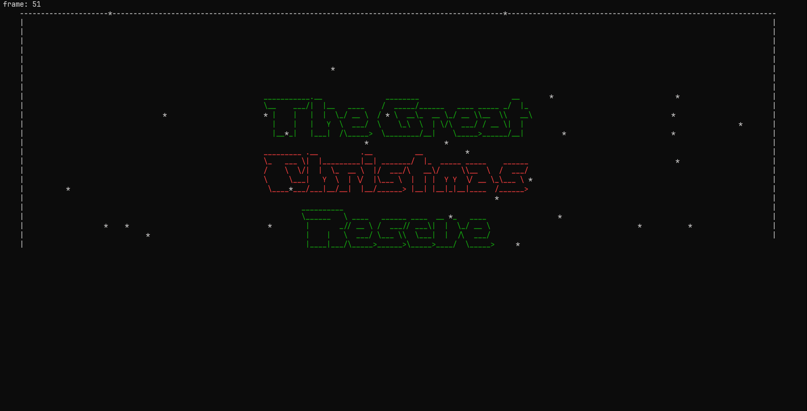

# CODÉDEX HOLIDAY HACKATHON



## Table of Contents
* [Project description](#project-description)
* [Install program](#install-program)

## Project description

Project for the Codédex Holiday Hackathon by faLALALA!!!

Members:

- Austin
- Hannah
- Yaz

This program is under the GNU General Public License v3.0

##   Install program

### Linux

First clone the repository

From the root directory of the repo run

```./dependencies```

### Mac

First clone the repository

From the root directory of the repo run

```./dependencies```

### Windows

First clone the repository

From the root directory of the repo run

```./dependencies.bat```
